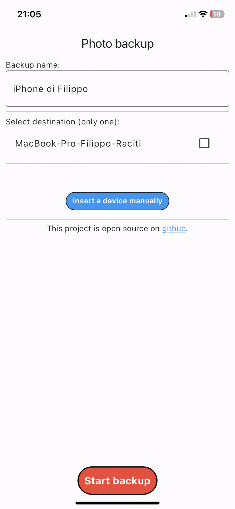

# Photo_Backup

## Introduction
I used flutter to create two applications (IOS and desktop) to make easy photo backup from your iPhone to a computer.
## Requirements
- [Flutter](https://docs.flutter.dev/get-started/install)
- [AltStore](https://altstore.io) (or something else to install applications on iPhone)
- IOS for mobile app and MacOS/Windows/Linux for desktop app
## Get Started
### Clone the project
``` bash
git clone https://github.com/filipporaciti/Photo_Backup.git
cd ./Photo_Backup
```
### Build
You can download builded files from latest release!!!

It could be possible that for some operative systems there isn't builded deskop app
#### Build ios app
On project directory:
``` bash
cd ./photobackup_mobile
flutter build ios
cd ./build/ios/iphoneos
mkdir Payload
cp -r Runner.app ./Payload
zip -r Payload.zip Payload
mv Payload.zip IOS-photobackup_mobile.ipa
```
On final directory you'll have .ipa file.

#### Build desktop app
On project directory:
``` bash
cd ./photobackup_desktop 
```
Based on your operative system:
- MacOS
``` bash
flutter build macos 
cd build/macos/Build/Products/Release
```
Executable file: photobackup_desktop
- Windows
``` bash
flutter build windows 
```
- Linux
``` bash
flutter build linux 
```

## Other things...
- If you want to adjust creation date and time, you can use `change_image_datetime.py` script.

## Screenshots

#### Desktop app:


#### IOS app:



